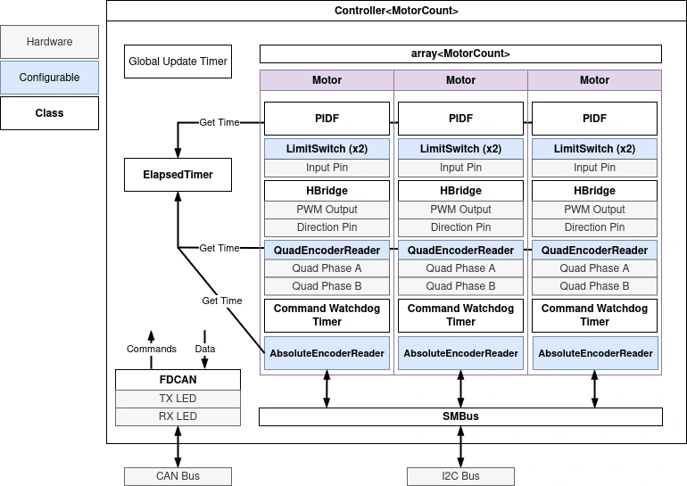

# Archive

This page contains archived documentation for older projects.

## 3BM (2024-2025)

Code: [mrover-esw/urc-2025](https://github.com/umrover/mrover-esw/tree/urc-2025/src/3bm)

Our brushed motors are controlled with a custom PCB that we call the "3BM". This
motor controller can control up to three brushed motors. It can support up to two limit
switches per motor and a total of one absolute encoder and one quadrature encoder.
We communicate with the board using CAN. The board communicates with the absolute encoder
using I2C.

### Code Structure

The driver code is in `controller.cpp` and the main motor control logic is in `motor.hpp`.
Motor CAN IDs and the number of motors is configured in `common.hpp`.
`controller.cpp` constructs up to three motors, initalizes the CAN bus, and starts the global
timers.

### Architecture

Below is a diagram of the 3BM architecture.

### Timer Overview

The 3BM uses seven hardware timers:

-   **htim1** (`PWM_TIMER_[0,1,2]`): PWM timer for the three motors (`TIM_CHANNEL_[0,1,2]` for motor [0,1,2], respectively)
-   **htim2** (`GENERIC_ELAPSED_TIMER`): Repeating count up timer where each tick is 0.001 ms (1000 ns). It used used by:
    -   The absolute and quadrature encoder to measure how much time has elapsed since the last reading in order to measure velocity
    -   The PIDF controller in order to measure the time elapsed since the last reading to update the "D" term
-   **htim4** (`QUADRATURE_TICK_TIMER`): Incremental encoder timer configured to read a two-phase quadrature encoder
-   **htim6** (`GLOBAL_UPDATE_TIMER`): 20 Hz timer which triggers a CAN FD transmit (sends motor state)
-   **htim15**, **htim16**, **htim17** (`RECEIVE_WATCHDOG_TIMER_[0,1,2]`): FDCAN watchdog timer that needs to be reset every time a message is received

## SA Arduino (2024-2025)

Code: [mrover-esw/urc-2025](https://github.com/umrover/mrover-esw/tree/urc-2025/src/sa_arduino)

The Science Acquisition (SA) Arduino is an Arduino MKR WiFi 1010 that is used for two purposes:

1. Read the temperature/humidity sensor ([DFRobot SHT20](https://www.dfrobot.com/product-1636.html)) on the SA sensor actuator
2. Control the servo ([DYNAMIXEL XL330-M288-T](https://www.robotis.us/dynamixel-xl330-m288-t/)) on the SA hex hub

The temp/humidity sensor is read using I2C, and the servo is controlled using the
[DYNAMIXEL Shield for Arduino MKR](https://www.robotis.us/dynamixel-shield-for-arduino-mkr-series/).

The Arduino communicates with the main rover computer (NVIDIA Jetson AGX Orin) using UART.
